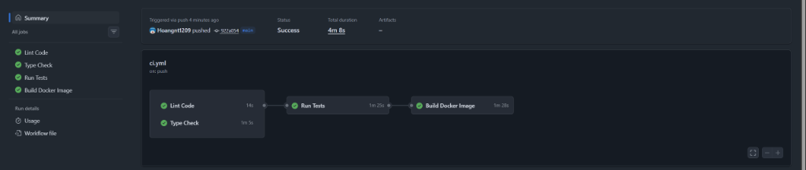

# Lab 3: Testing & CI/CD for ML Systems



## 📌 Báo Cáo Kết Quả Thực Hiện (Summary of Accomplishments)

Dự án đã hoàn thành toàn bộ các hạng mục công việc được yêu cầu trong Lab 3 với tỷ lệ bao phủ mã nguồn (**Code Coverage**) đạt **100%** và tự động hóa toàn bộ quy trình CI/CD trên GitHub Actions:

### 1. 🧪 Bộ Kiểm Thử Comprehensive Test Suite (96 Test Cases - 100% Coverage)
- **Unit Tests (`tests/unit/`)**: 
  - Kiểm thử toàn diện lớp `MovieRatingModel` (nạp model, dự đoán đơn, dự đoán theo batch, xử lý ngoại lệ file hỏng/thiếu, singleton pattern `get_model()`, `reset_model()`).
  - Kiểm thử Pydantic schemas trong `app/schemas.py` (`PredictionRequest`, `PredictionResponse`, `BatchPredictionRequest`, `HealthResponse`).
- **Integration Tests (`tests/integration/`)**: 
  - Kiểm thử tích hợp các REST API endpoints của FastAPI (`GET /`, `GET /health`, `POST /predict`, `POST /predict/batch`, `GET /model/info`).
  - Kiểm thử đầy đủ các mã lỗi HTTP standard: `404 Not Found`, `405 Method Not Allowed`, `422 Validation Error`, `500 Internal Server Error`, và `503 Service Unavailable`.
- **Data Quality Tests (`tests/data/`)**: 
  - Kiểm định chất lượng bộ dữ liệu MovieLens 100K (tính đầy đủ, giá trị null, phạm vi điểm đánh giá 1.0 - 5.0, tính duy nhất và phân bố ID người dùng/phim).
- **Model Behavioral Tests (`tests/model/`)**: 
  - Kiểm thử hành vi mô hình Machine Learning: Invariance tests (đầu vào giống nhau cho kết quả giống nhau), Directional tests, Minimum Functionality tests, Performance & Robustness với ép kiểu ID dạng String/Integer.

### 2. ⚙️ Quy Trình Tự Động Hóa CI/CD (`.github/workflows/`)
- **CI Pipeline (`ci.yml`)**:
  - **Lint Code**: Kiểm tra định dạng code nghiêm ngặt bằng `black`, `isort`, và `flake8`.
  - **Type Check**: Kiểm tra kiểu dữ liệu tĩnh với `mypy`.
  - **Run Tests**: Tự động huấn luyện mô hình (`scripts/train_model.py` với cờ non-interactive `prompt=False`), thực thi 96 pytest test cases và xuất báo cáo coverage XML/HTML.
  - **Build Docker Image**: Xây dựng Docker Image dựa trên `python:3.10-slim`, tích hợp các gói C build (`gcc`, `build-essential`) và `curl` để kiểm tra sức khỏe container.
- **CD Pipeline (`cd.yml`)**:
  - Tự động kích hoạt khi push Git Tag `v*`, đóng gói và đẩy Docker Image lên Docker Hub, khởi tạo GitHub Release.

### 3. 🛡️ Chuẩn Mã Nguồn & Pre-commit Hooks (`.pre-commit-config.yaml`)
- Tích hợp các công cụ kiểm soát chất lượng code tự động trước khi commit (`black`, `isort`, `flake8`, `mypy`, `pytest`).

---

## Overview

Implement comprehensive testing strategies and CI/CD pipelines for the movie rating prediction system to ensure quality and automate deployment.

## Project Structure

```
ddm501-lab3-starter/
├── app/
│   ├── __init__.py
│   ├── main.py             # FastAPI application
│   ├── model.py            # ML model class
│   ├── schemas.py          # Pydantic schemas
│   └── config.py           # Configuration
├── tests/
│   ├── __init__.py
│   ├── conftest.py         # Shared fixtures
│   ├── unit/
│   │   ├── __init__.py
│   │   ├── test_model.py   # Model unit tests (TODO)
│   │   └── test_schemas.py # Schema tests (TODO)
│   ├── integration/
│   │   ├── __init__.py
│   │   └── test_api.py     # API tests (TODO)
│   ├── data/
│   │   ├── __init__.py
│   │   └── test_data_quality.py  # Data tests (TODO)
│   └── model/
│       ├── __init__.py
│       └── test_model_behavior.py  # Behavioral tests (TODO)
├── .github/
│   └── workflows/
│       ├── ci.yml          # CI pipeline (TODO)
│       └── cd.yml          # CD pipeline (TODO)
├── scripts/
│   └── train_model.py      # Model training script
├── models/                 # Saved models
├── .pre-commit-config.yaml # Pre-commit hooks (TODO)
├── pyproject.toml          # Project configuration
├── requirements.txt
├── requirements-dev.txt    # Development dependencies
├── Dockerfile
└── README.md
```

## Quick Start

### 1. Clone and Setup

```bash
unzip ddm501-lab3-starter.zip
cd ddm501-lab3-starter

# Create virtual environment
python -m venv venv
source venv/bin/activate  # Linux/Mac

# Install dependencies
pip install -r requirements.txt
pip install -r requirements-dev.txt
```

### 2. Train Model (if not exists)

```bash
python scripts/train_model.py
```

### 3. Run Tests

```bash
# Run all tests
pytest tests/ -v

# Run with coverage
pytest tests/ -v --cov=app --cov-report=html

# Run specific test category
pytest tests/unit/ -v
pytest tests/integration/ -v
pytest tests/data/ -v
pytest tests/model/ -v
```

### 4. Code Quality Checks

```bash
# Install pre-commit hooks
pip install pre-commit
pre-commit install

# Run all checks manually
pre-commit run --all-files

# Individual tools
black app/ tests/
flake8 app/ tests/
mypy app/
```

### 5. Run the API

```bash
uvicorn app.main:app --reload --host 0.0.0.0 --port 8000
```

## TODO Tasks

Completed all required tasks:

### Test Files
- [x] `tests/unit/test_model.py` - Unit tests for model class
- [x] `tests/unit/test_schemas.py` - Schema validation tests
- [x] `tests/integration/test_api.py` - API endpoint tests
- [x] `tests/data/test_data_quality.py` - Data quality tests
- [x] `tests/model/test_model_behavior.py` - Behavioral tests

### CI/CD Files
- [x] `.github/workflows/ci.yml` - CI pipeline
- [x] `.github/workflows/cd.yml` - CD pipeline (BONUS)
- [x] `.pre-commit-config.yaml` - Pre-commit hooks

### CI/CD Pipeline Execution Status


## Test Types

### Unit Tests
Test individual functions and classes in isolation.

```python
def test_model_loads_successfully(model):
    assert model.is_loaded()
```

### Integration Tests
Test component interactions and API endpoints.

```python
def test_predict_valid_request(test_client):
    response = test_client.post("/predict", json={"user_id": "196", "movie_id": "242"})
    assert response.status_code == 200
```

### Data Tests
Validate data quality and schema.

```python
def test_ratings_in_valid_range(sample_ratings):
    for r in sample_ratings:
        assert 1.0 <= r["rating"] <= 5.0
```

### Behavioral Tests
Test model behavior patterns.

```python
def test_same_input_same_output(model):
    result1 = model.predict("196", "242")
    result2 = model.predict("196", "242")
    assert result1 == result2
```

## CI/CD Pipeline

### Continuous Integration
- Runs on every push and pull request
- Executes linting, type checking, and tests
- Reports code coverage

### Continuous Deployment (BONUS)
- Triggered on version tags
- Builds and pushes Docker image
- Deploys to staging/production

## Grading Rubric

| Criteria | Weight |
|----------|--------|
| Test Coverage (unit, integration, data, model) | 30% |
| CI/CD Pipeline | 30% |
| Code Quality | 20% |
| Documentation | 20% |

